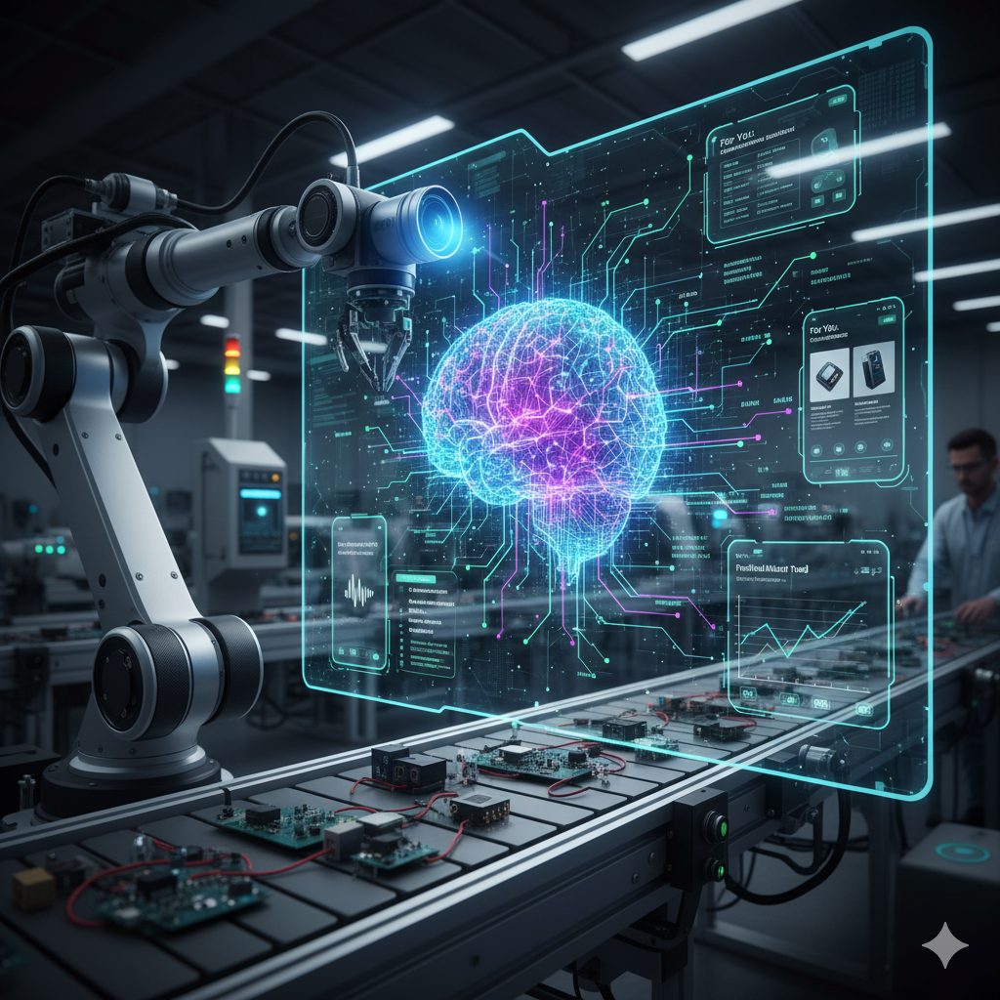

# DevOps Portfolio

---
### About Me
I am Karthik Reddy, a Senior DevOps Engineer with 12 years of experience at SAP Labs India. I specialize in bridging the gap between development and operations to streamline software delivery. My expertise lies in building and maintaining robust, scalable, and secure infrastructure. I am proficient in English, Hindi, Telugu, and Kannada.

---
### Professional Experience
**Senior DevOps Engineer** | SAP Labs India
(12 years of experience)

As a senior engineer, I lead initiatives to automate and optimize software development lifecycles, ensuring seamless integration and continuous delivery.

---
### Education & Certifications
* Executive PG in AI and ML from IIITB

---
### Skills & Expertise
* **Languages:** English, Hindi, Telugu, Kannada
* **Certifications:** Executive PG in AI and ML (IIITB)
* [View my full profile on LinkedIn](https://www.linkedin.com/in/karthik-reddy-222b1075/)

---
### Projects

---
**AI in robotics**
*Imagine a robotic arm in a factory. It's not just repeating a pre-programmed motion. Instead, it's using computer vision to identify different components on a conveyor belt, making real-time adjustments to its grip and movement to pick up each one accurately. The image would show the robot's arm, a camera as its "eye," and a user interface displaying the objects it's identifying. The overall scene would suggest a blend of physical machinery and intelligent, data-driven decision-making.*

* 

---
**AI in Modern IT**
Visualize a complex web of interconnected data points, lines, and nodes, symbolizing a large dataset. At the center of this web, there is a glowing, neural network-like structure that is processing the data. Surrounding this central core are various applications and interfaces—a smart assistant on a smartphone, an e-commerce recommendation engine with product suggestions, and a financial dashboard predicting market trends. The image would highlight how AI is the "brain" powering a wide range of modern software applications.*

* 

